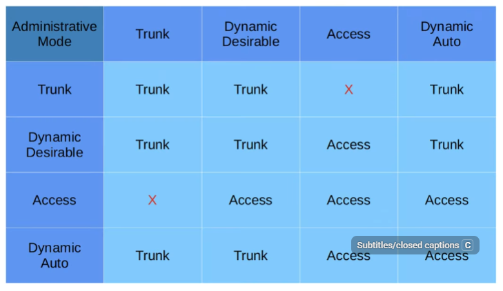
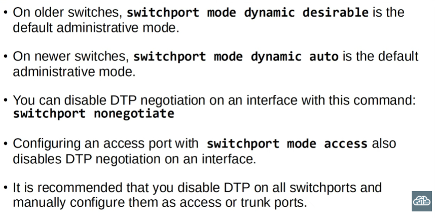
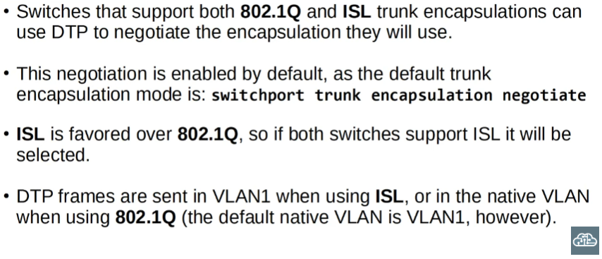
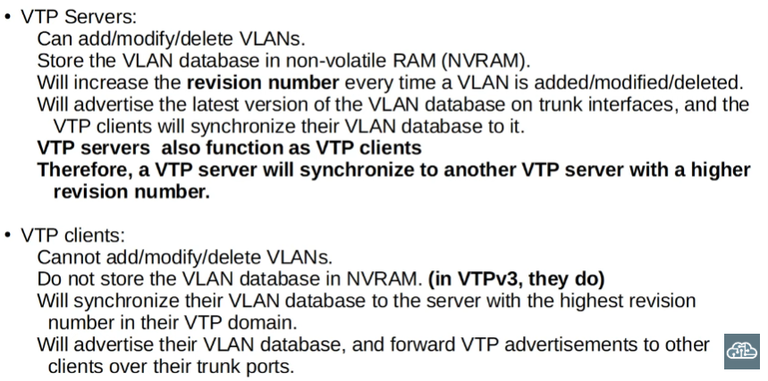
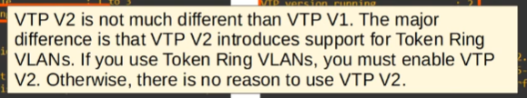
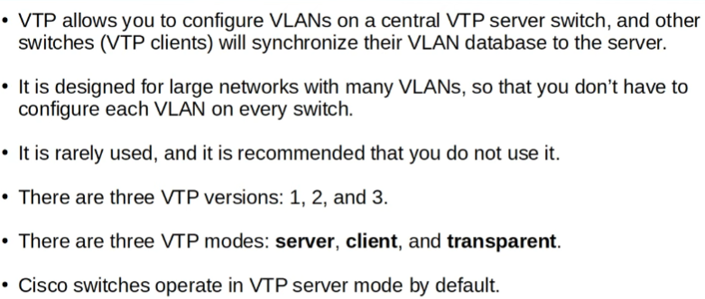

# Day 19

DTP: Cisco propietary protocol that allows switches to negotiate the status of their ports to be either access ports or trunk ports without manual configuration

Today we will also cover VTP

--- 
## DTP

>Because it is Cisco proprietary, it is enabled on all Cisco switch interfaces by default. Due to manual configuration being safer than dynamic determination of interface status however, DTP should ideally be disabled (can be exploited by attackers)

### In the CLI

```
SW2(config-if)#switchport mode auto
```
```
SW2(config-if)#switchport mode desirable 
```
---
A switch set to the first mode will actively try to form a trunk with other Cisco switches and will form a trunk to another switchport in the following modes: 
- switchport mode trunk
- switchport mode dynamic desirable 
- switchport mode dynamic auto

>A switchport in dynamic auto mode does not actively try to form a trunk\
NOTE: It will tell SW1 'if you want to form a trunk I will form a trunk, but I will not actively try to form a trunk connection w/ you' 

SW1 g0/0: switchport mode dynamic desirable\
|  
v  
SW2 g0/0: switchport mode access 

>A trunk connection will not be formed

---
## dynamic auto

As stated, it won't actively try to form a trunk connection, but it will if the switch it is connected to is actively trying to (switchport mode trunk, dynamic desirable) 

dynamic auto + dynamic auto = access

We cannot have an interface set to switchport mode trunk connected to an interface set to access. Mismatched modes like this will result in errors and traffic not passing between the switches  





--- 
Switch interfaces that operate in trunk mode can also use DTP to negotiate the encapsulation they will use

The DTP frames that DTP uses to negotiate are sent in VLAN1 when using ISL and the native VLAN when using 802.1q 



--- 
# VTP

Protocol designed for large networks with lots of VLANs where manual configuration of every switch would be time-consuming and tedious. It is rarely used however 

>Permite configurar VLANs en un switch central 'servidor de VTP' de tal modo que otros switches (clientes de VTP) puedan sincronizar su bdd de VLANs a la del servidor

There are 3 versions: 1, 2 and 3

Modos de VTP: server, client & transparent 

- Server: 
  - Add/modify/delete VLANs
  - Store VLAN database in non-volatile RAM
  - Increases revision number every time one of the operations specified above occurs. A revision number is what VTP uses to determine the newest ver. of a database. New versions are advertised on trunk interfaces so that the VTP clients can synchronise their own VLAN databases to it



--- 
## How does VTP work?

To view VTP status...
```
SW1#sh vtp status
``` 

- VTP version capable and running: what versions it can run and which one it is running 
- VTP domain name: switches sharing a domain name will synchronise their changes 
- VTP operating mode: server/client
- Maximum VLANs supported locally, number of existing VLANs, config. revision (increases when we modify the database)
---

>NOTE: If a switch with no TVP domain receives a VTP advertisement it will automically join that VTP domain :)

NOTE II: If a switch receives a VTP advertisement in the same VTP domain with a higher revision number it will update it's VLAN database to match

### WARNING 
If an old switch with a higher revision number is connected to the network, switches matching it's domain name will sync their VLAN databases to match the newly installed old switch

Example at ~21.30

--- 
### VTP Transparent 

>NOTE: We can configure a swirch to work in 'client mode' using the command ```SW2(config)#vtp mode client```

VLAN config. is not allowed when a device is in CLIENT mode 

Summary: a switch employing VTP that operates in transparent mode will not change it's local database based on other switch's VTP advertisements and it does not propagate changes made to it's database to other switches. Unlike switches operating in client mode however, they can have their VLAN database locally updated

---

- Changing the VTP domain to an unused domain resets the revision num. to 0. Same thing happens if we change the TVP mode to transparent

**NOTE:** Transparent switches will however forward other switch's VTP advertisements to other switches in the network

To change VTP version...
```
SW2(config)#vtp version 2
```

There is little reason to use version 2, and ver. 3 is beyond the scope of the CCNA 



## Summary:

