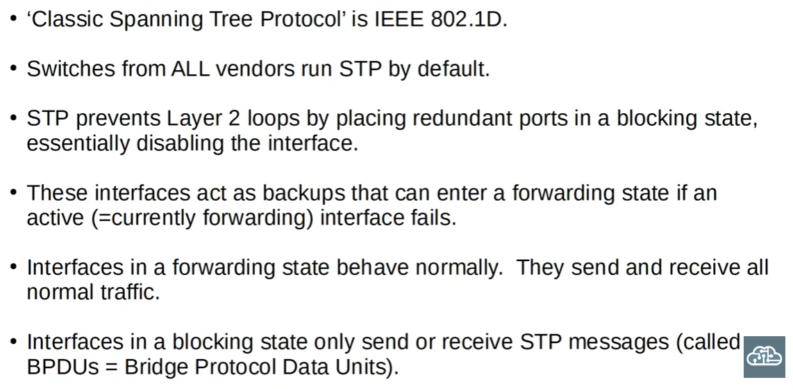
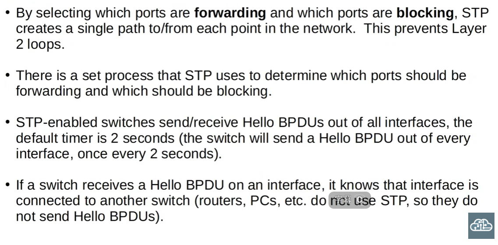
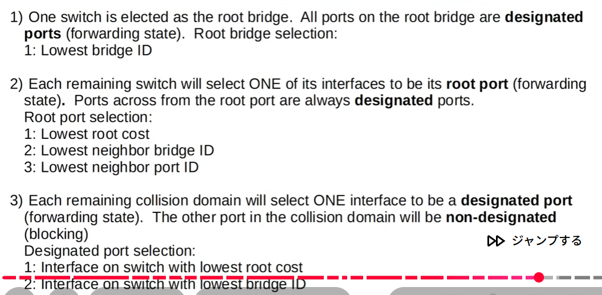
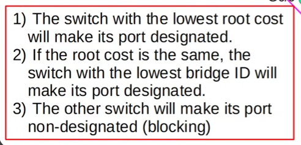
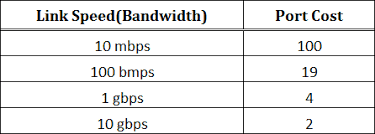
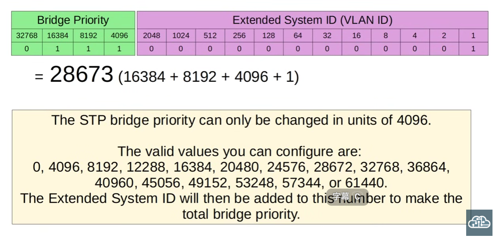
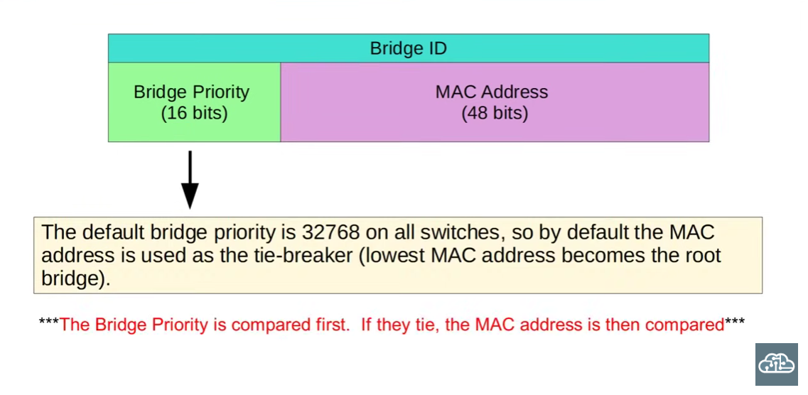

# Day 20 - Spanning Tree Protocol

### Redundancy
Redundancy is an essential part of network design- a network must be redundant\
Even a short downtime can be highly detrimental for a business and equate to large losses. **We must diligently avoid single points of failure that cut off connectivity for an entire network**

- It is worth noting that most PCs only have one NIC (Network Interface Card), so they can only be plugged to a single switch

## Spanning tree protocol (IEEE 802.1D)

### Key concepts: 
- It is important to have alternate paths in the case that a network connection fails
- A broadcast storm in a network is a severe traffic jam caused by an excessive flood of broadcast or multicast packets, often due to a *network loop* (like two switches connected by two cables without Spanning Tree Protocol).
- STP is a protocol that ensures all switches within a network are connected via a single logical path *at a time*. It makes sure that there is redundancy in the network implemented in such a way that avoids broadcast storms 

>The Ethernet header has no such feature the way a layer 3 header does that enables the "dropping" of any PDUs in the case that they have hopped from device to device for an extended amount of time. If frames are looped within a network, this loop will continue indefinitely. We also must bear in mind the concept of MAC Address Flapping in the context of switches learning MAC addresses via the source MAC address field of a specific Ethernet header

- STP messages are used by switches to:
- Prevent loops within a given topology
- Block redundant links
- Determine the best path from switch to switch within a network
---
>In the context of modern networks, "bridge" = "switch"

*What is a hello BPU?*
A Hello BPDU is a periodic packet that keeps the spanning tree alive and stable, allowing switches to adapt to network changes. Standards dictate that Hello BPDUs be sent out by switches every 2 seconds.\
Switches send them out to each other. If a switch receives a Hello BPDU in a given interface, it knows that that interface is connected to a switch rather than, say, a router or PC: because PCs and routers do not send out or forward Hello BPDUs. 

>Switches use the Bridge ID field of a BPDU to elect the root bridge of a network: the one with the lowest ID is elected as root bridge.  

- All ports in the root bridge are put in a forwarding state and other switches must have a path to send data to said root bridge interfaces. All non-root switches need to have exactly one root port.

Redundant paths are put in blocking states as a means to prevent broadcast storms.

---
# Bridge ID

It is worth mentioning that the bridge ID field can be divided into two seperate subfields: Bridge priority (4 bits) and extended system ID (VLAN ID) (12 bits)

## VSTP 
>Per-VLAN Spanning Tree (PVST) is a Cisco proprietary protocol that runs a separate Spanning Tree Protocol (STP) instance for each VLAN, allowing for customized loop-free topologies and efficient traffic load balancing across different VLANs, unlike traditional STP which uses a single instance for all VLANs

>Per-VLAN Spanning Tree Protocol is valid and safe precisely because broadcast domains are scoped to individual VLANs.\
As long as each VLAN has its own loop-free Layer 2 topology with exactly one root bridge, broadcast storms are prevented within that VLAN, regardless of what happens in other VLANs

### Why is the default bridge priority 32768? (img. attached)
This is due to it's original bit length. In the defualt VLAN, VLAN 1, it's actually 32769

Given that in PVST the first 12 bits of the bridge priority field are dedicated to the extended system ID (or VLAN ID, which is fixed), priority differs in units of 4096 

*Designated ports = ports in the forwarding state*

- Each switch interface has a port cost based on its link speed.
- STP adds the port cost of each hop toward the root bridge.
- The interface with the lowest total root path cost is selected as the root port on a non-root switch.

>Root costs are calculated using outgoing interfaces only

- Root ports exist only on non-root switches and indicate the path to a root bridge with the lowest associated root cost. They send traffic "upstream" and each switch has exactly one root port. No more, no less
- Designated ports exist within LAN segments (examples: switch-to-switch links and switch-to-host links); they forward traffic away from the root into the given LAN segment, contrary to the direction that root ports forward traffic to. EVERY COLLISION DOMAIN HAS A SINGLE STP DESIGNATED PORT

---
What does the command ´´´SW1#show spanning-tree´´´  display? 
- In this lesson, we will be specifically taking a look at the priority numbers associated with switch interfaces 

>STP port priority = port priority + port number

Switches will additionally consider the port number of the neighboring switch when choosing their root port

---
### On a link between two switches, how does STP determine which interface is blocked? (img. attached)

- Lowest root path cost to the root bridge
- Lowest bridge ID of the sending switch
- Lowest port ID (tiebreaker)