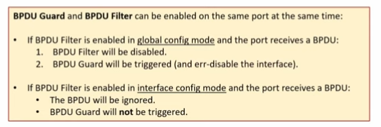
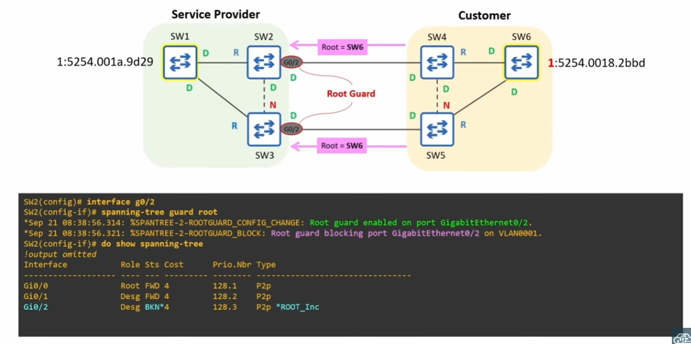
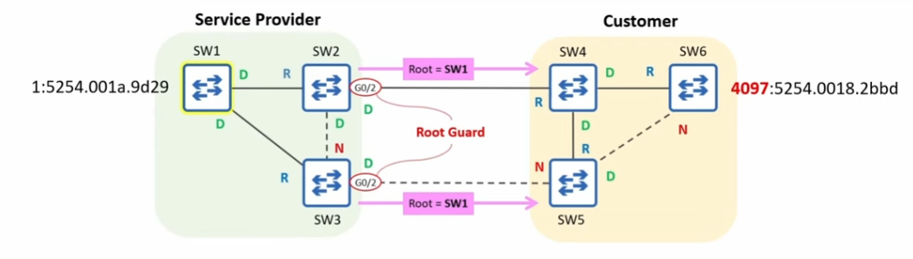
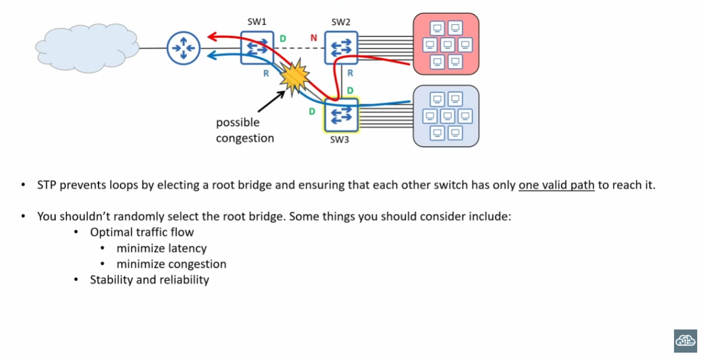
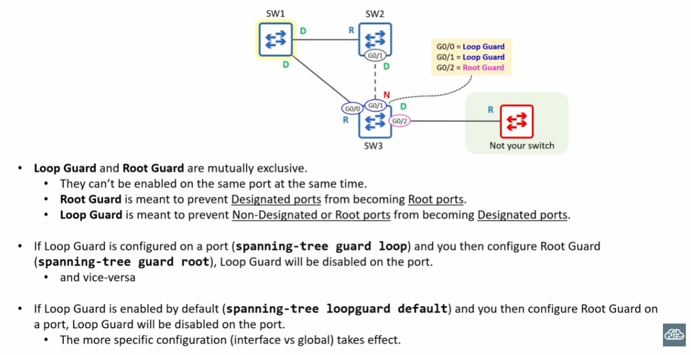
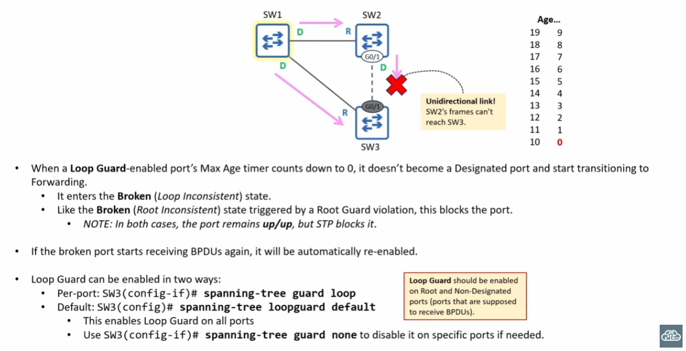

# Portfast

>Cuando un cliente o servidor se conecta a la interfaz de un switch, por default tarda 30 minutos en llegar a poder recibir/mandar data\
Esto puede afectar la experiencia de usuario. La espera no es necesaria

PorFast permite que una interfaz entre de inmediato a un estado "Forwarding", salteandose las etapas de Listening y Learning

## Cómo se configura?

Hay dos maneras:

1. EN INTERFACE CONFIG MODE:\
```SW1(config-if)# spanning-tree portfast [edge]```
Habilita Portfast solo en la interfaz de manera individual. Se recomienda no habilitar Portfast en vínculos trunk o en conexiones a otros switches para evitar loops en la 2da capa.

2. EN GLOBAL CONFIG MODE:\
```SW1(config)# spanning-tree portfast [edge] default```\
El comando habilita Portfast en todos los access ports de un switch.   
Puedo usar spanning-tree portfast disable para luego deshabilitar Portfast en **interfaces especificas**

- NOTA: Vinculos entre switches casi siempre son trunk, mientras que los vinculos a "end hosts" casi siempre son access links 

---

>Aunque no es necesariamente recomendable, puedo habilitar portfast en una interfaz trunk con el siguiente comando:

```SW1(config-if)#spanning-tree portfast [edge] trunk```

I can check what kind of portfast the interface is employing with the use of the command:

- SW1# sh spanning-tree interface g0/1 detail

A standard portfast config. only enables PortFast on access ports
  
  ---
# BPDU Guard 

Portfast debería habilitarse unicamente en interfaces conectadas a dispositivos no switch. Una interfaz con Portfast habilitada aun manda BPDUs y opera como una interfaz STP regular si recibe BPDUs de un vecino\
Esto es peligroso, ya que, en el caso hipotetico de que un usuario conecte un switch a una interfaz con PF habilitado, esto podría significar cambios en toda la topología STP

>BPDU Guard es una herramienta que previene contratiempos que surgen ante la situación de la conexión de un switch no autorizado a la red

- Si usamos BPDU Guard, la interfaz, ante recibir un Bridge Protocol Data Unit, entrará en el estado "err-disabled", efectivamente deshabilitandola.

***Podemos configurar por interfaz o por default**

- SW1(config-if)# spanning-tree bpduguard enable
- SW1(config)# spanning-tree portfast [edge] bpduguard default

The second command enables BPDU Guard on all PortFast-enabled ports

Usar 
```spanning-tree bpduguard disable```

Deshabilita BPDU guard en interfaces específicas

## Una interfaz deshabilitada puede ser rehabilitada de dos maneras:

- Manual: shutdown y no shutdown

- Automático: ErrDisable Recovery
    - SW1(config)# errdisable recovery cause bpduguard

    - El timer de recuperación es 300 segundos; lo que quiere decir que las interfaces err-disabled se re-habilitaran automaticamente luego de 5 minutos\
    Podemos modificar el timer con el comando:

```SW1(config)# errdisable recovery interval```

## BPDU Filter:
>Previene que una interfaz envie BPDUs\
Esto es util para ahorrar ancho de banda y poder de procesamiento en el switch y además para asegurar máxima seguridad (así los dispositivos de usuario no reciben BPDUs)

- A diferencia de BPDU guard, no deshabilita la interfaz si recibe un BDPU

POR INTERFAZ:
```SW1(config)# spanning-tree bpdufilter enable```

- Esto hace que la interfaz ignore cualquier BPDU que vaya a recibir. SE DEBE USAR CON PRECAUCIÓN

DEFAULT:
```SW1(config)# spanning-tree portfast [edge] bpdufilter default```

- Habilita BPDU Filter en todas las interfaces PortFast-enabled
- Si la interfaz recibe un BPDU se deshabilita Portfast y BPDU Filter y la interfaz pasa a operar como una interfaz STP normal

>Recomendación: Habilitar Portfast y BPDU Guard como resulte deseable, solamente habilitar BPDU filter por default. 



---
# Root Guard

- Cuándo seleccionamos un "root bridge" debemos considerar:
  - Flujo óptimo del tráfico dentro de la red
  - Minimizar delay/latency
  - Minimizar la congestión
  - Estabilidad y confiabilidad

>Dentro de una LAN propia, es facil el control del "root bridge"; basta con hacer que su prioridad vala 0\
Sin embargo, hay casos en dónde a lo mejor conecte mis switches a otros switches fuera de mi control (proveedor de servicios, cliente...)

*Configurando **Root Guard** en ciertos puertos, prevenimos que estos mismos acepten BPDUs "superiores" de switches fuera de nuestro control*

### Configuración/Comando:

```SW(config-if)# spanning-tree guard root```

- No existe un comando para habilitarlo por default desde "global config mode"

- Root guard se asegura de que un puerto no se transforme en un "root port" aun si recibe un BPDU superior a través del siguiente mecanismo: si el puerto recibe un BPDU superior, pasa a un estado "Broken" (BKN)/"Root Inconsistent" (ROOT_Inc)

>Una vez que deja de recibir BPDUs, se recuperará automaticamente

**Recordemos que podemos observar el estado de los puertos con el comando...**

```
SW2(config)# interface g0/2
SW2(config-if)# spanning-tree guard root
SW2(config-if)# do show spanning tree
```



We can solve the issue like this:



>We tell the customer to increase the priority value of their switch\
Once the superior BPDUs received by SW2 g0/2 and SW3 g0/3 age out, the ports will automatically be re-enabled (remember that a BPDUs Max Age is 20 secs by default)



---
# Loop Guard 

>Loop Guard protege a la red de loops "bloqueando" un puerto si repentinamente deja de recibir BPDUs. Esto se puede dar como consecuencia de:\
. Un defecto en el SW que no permite que un switch envie BPDUs\
. Un problema en el HW que provoca, accidentalmente, un vínculo unidireccional

### Vínculos unidireccionales

- Enlace de red en dónde la transmisión de datos ocurre solo hacia una dirección

  - Usualmente su causa se puede atribuir a problemas en la 1ra capa, como desperfectos en los cables de fibra óptica
  - Si los dispositivos conectados no detectan el problema y prontamente deshabilitan sus interfaces, puede terminar esto en un vínculo unidireccional
  - Si un puerto "Root" o "Non-designated" deja de recibir BPDUs, supone que no está conectado a otro switch y por ende se transforma en un Designated port. Esto tiene la chance de provocar un Layer 2 loop

## Configuración, habilitación

>Se puede configurar tanto por puerto cómo por default

```
SW3(config-if)# spanning-tree guard loop
```

```
SW3(config)# spanning-tree loopguard default
```

También podemos deshabilitarlo, en puertos en específico, así:

```
SW3(config-if)# spanning-tree guard none
```

***IMPORTANTE:***
- Loop Guard y Root Guard son mutuamente exclusivos. Por qué?

  - Loop Guard evita que un puerto root o non-designated se transforme en uno designated, mientras que Root Guard evita que un puerto designated se transforme en uno root. 

  - Loop Guard se ocupa de prevenir loops y Root Guard se ocupa de prevenir cambios inesperados en la topología en casos de, por ejemplo, la conexión de switches no autorizados. Lo que tienen en común es que ambos buscan reducir la congestión y latencia dentro de una red

>Si configuramos Loop Guard en un puerto y luego configuramos Root Guard, Loop Guard se deshabilitará por automático (y viceversa)

>Si Loop Guard está configurado por default (spanning-tree loopguard default) y luego configuramos Root Guard en un puerto, Loop Guard se deshabilitará *en ese puerto*





- It is important to keep in mind that switches will ignore BPDUs inferior to their own (they don't modify their interfaces based on BPDUs with a higher Bridge ID)