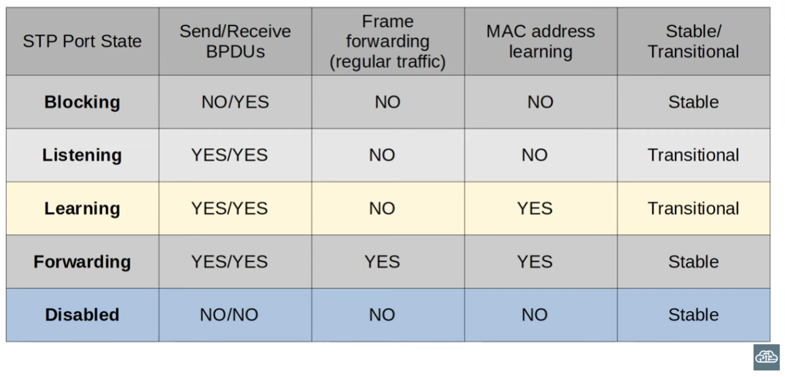
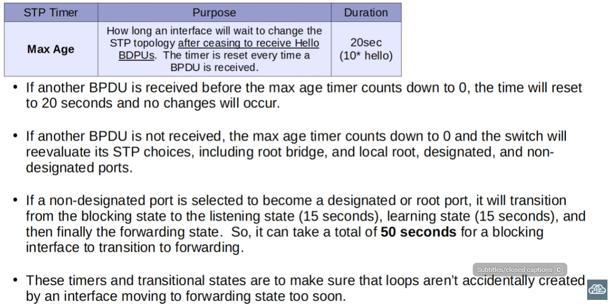
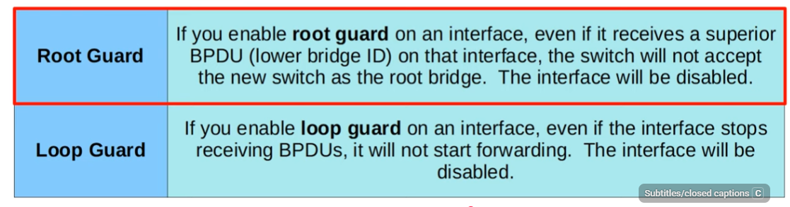
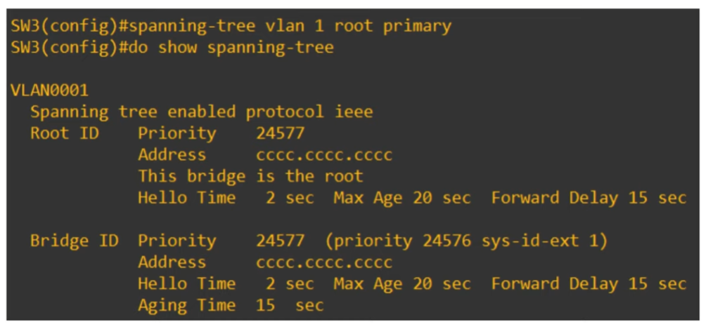

## Day 21: Spanning tree pt. 2

### Spanning tree protocol port states

| STP Port State | Stable/Transitional |
| :------------: | :-----------------: |
|    Blocking    |       Stable        |
|   Listening    |    Transitional     |
|    Learning    |    Transitional     |
|   Forwarding   |       Stable        |

- Root/Designated ports remain stable in a forwarding state
- Non-designated ports remain stable in a blocking state

>The transitional listening and learning states occur when an interface is activated or when a blocking port must transition to a forwarding state due to changes in the network topology

- Interfaces in a ***blocking state*** receive STP BPDUs but do not forward them, and interfaces in a blocking state do not learn MAC addresses

- As for the ***listening state***, an interface can transition to the listening state when a topology change causes STP to recalculate port roles. This transition occurs when an interface moves towards forwarding, never on the way to blocking. The listening state is 15 seconds long by default and an interface in this state only receives and forwards BPDUs, it does not send or receive regular network traffic nor learn MAC addresses. 

- After the listening state, a designated or root port enters the ***learning state*** which is 15 seconds long by default. Just like in the listening state, the length of time for which this learning state is held depends on the "Forward Delay timer". It only sends and receives BPDUs but does not send or forward regular traffic, but it does learn MAC addresses in preparation for forwarding network traffic.
  
- Root and designated ports are in a ***forwarding state***. Forwarding state ports send and receive BPDUs, send and receive normal traffic and learn MAC addresses. 


---

## STATE TIMERS

|     STP Timer     |                                             Purpose                                             |   Duration    |
| :---------------: | :---------------------------------------------------------------------------------------------: | :-----------: |
|     **Hello**     |                          How often the *root bridge* sends hello BPDUs                          |     2 sec     |
| **Forward delay** |               How long the switch will state in the listening and learning states               | 15 sec (each) |
|    **Max Age**    | How long an interface will wait after ceasing to receive Hello BPDUs to change the STP topology |    20 sec     |

>Note: Only the root switch generates *configuration* BDPUs, non-root switches only relay them and generate "updated" versions of them with modified path cost and bridge info. and forward them on their designated interfaces



**A forwarding interface can move directly to a blocking state**

**A blocking interface however must go through the listening and learning stages first if it is to transition to forwarding. This is because there is concern here of creating a loop if an interface is too quick to transition to a forwarding state, which is very risky**

---
Cisco's Per-VLAN Spanning Tree+ uses the dest. MAC address of 01000.0CCC.CCCD for it's BPDUs

>PVST+ differs from PVST in the sense that it supports both dot1q and ISL for trunk encapsulation, not just ISL

Resulgar STP uses a dest. MAC of 0180.C200.0000

### What is included in the BPDU? 

**First 3 fields:**
- Protocol ID: 0x0 for classic ST
- Protocol Version ID: 0 for classic ST
- BPDU type: 0x0 for "configuration BPDUs"

**Flags:**
- Signal topology changes to other switches

**Root identifier:**
- Identifies the root bridge for the entire STP topology, including root bridge priority, root bridge system ID (VLAN ID) and root bridge system ID (MAC address of the root bridge)

**Root path cost:**
- Holds a value of 0 in the case of the root bridge

**Bridge identifier:**
- If the info. here is the same as the info. in "Root Identifier", we can be sure that we are inspecting the root bridge of a STP topology

**Port identifier:** 
- Interface that sent the BPDU

**Message age:** 
- 0 at the root bridge

>We can also see the fields "Max Age", "Hello Time" and "Forward Delay"
---
## STP toolkit

Portfast enables a port to move immediately to the forwarding state at link up, bypassing Listening and Learning. This is useful for interfaces connected to end devices rather than other switches

We can enable it like this:

```
SW1(config)#interface g0/2
SW1(config)#spanning-tree portfast
```

- It only takes effect if the port is an access port, an interface in non-trunking mode

- The command\
SW1(config)#spanning-tree portfast default\
enables portfast on all access ports but not trunk ports 

## BPDU Guard

- Helpful in the case of protecting loop formation if, for example, the end device an interface using portfast is connected to is replaced with a switch connected to another switch.

- If BPDU guard is enabled, the interface will be disabled in the case that it receives a BPDU from another switch

- SW1(config-if)#spanning-tree bpduguard enable

- It can also be enabled from global config mode using the command SW1(config)#spanning-tree portfast bpduguard default
  
>To enable a port shut down by BPDU guard, simply:

```
SW(config-if)#shutdown
SW(config-if)#no shutdown
```

### Other basic operations


---

# STP configurations

I can configure the spanning mode the tree uses like this:

```
SW1(config)#spanning-tree mode ?
SW(config)#spanning-tree mode pvst
```

>Modern switches run rapid-PVST by default

- A root bridge can be manually configured by manipulating the bridge priority of a given switch
- We can also configure a "secondary" root bridge\
To achieve this we use the command SW2(config)#spanning-tree vlan 1 root secondary\
We validate executing do show spanning-tree in global config. mode



### What is STP load balancing? 

- Using multiple spanning tree instances so that differnet VLANs use different forwarding paths. Traffic is distributed across links

>The STP cost of a switch interface can be manually configured to influence path selection

```
SW1(config)#interface g0/1
SW1(config-if)#spanning-tree cost 10
```

>STP port priority is a tiebreaker value used by STP when selecting ports, after root path cost and bridge ID are equal. If a switch port has a STP port ID of 0x8002 then the STP priority of the port is equal to 128, because the first half of the port ID (hex. 8 0) is the STP port priority. 