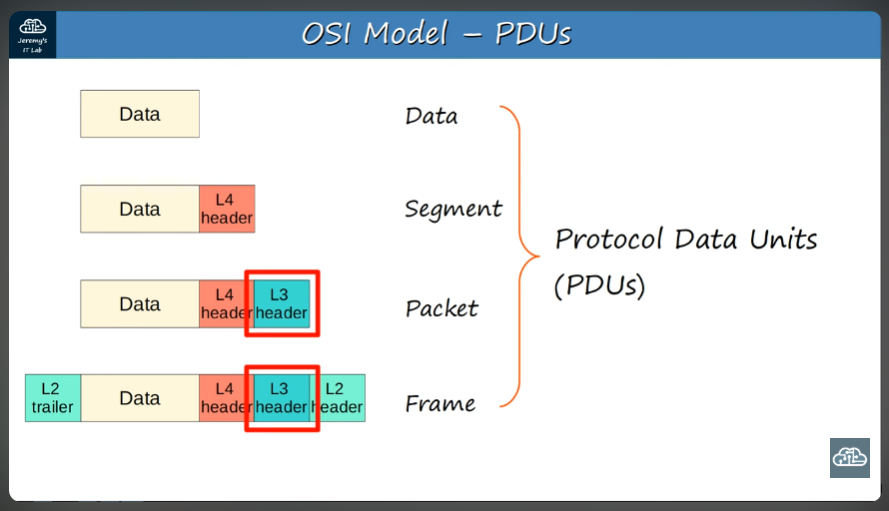
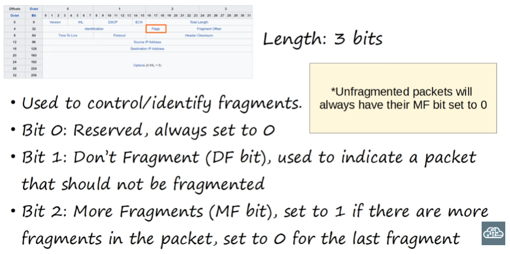
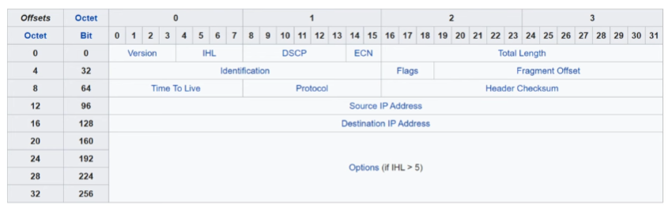
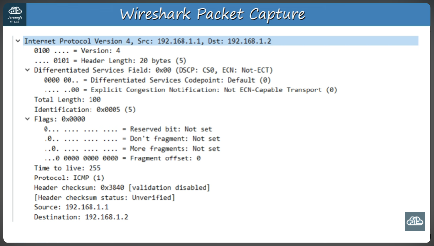

# Day 10: IPv4 Header
\
We will cover IPv4 packet structure; it's fields

*The process of encapsulation as information travels through the OSI model's layers is illustrated in the above image. Each PDU holds a different name. Today we will look at the layer 3 header which contains routing information for our frame*

## Each field of a header:
- **Version:** Identifies the version of IP being used. IPv4 = 0100 and IPv6 = 0110. IPv5 was never publically used, so we will consider only two versions

- **IHL:** (Internet Header Length) 4 bits in length- The final field of the IPv4 header is variable in length; this field helps indicate the total length of the header in 4 byte increments. So for example, if it has a value of 5, the length of the header will be 20 bytes because 5 * 4 = 20. The minimum value in this field is 5, and the maximum is 15

- **DSCP:** (Differentiated Services Code Point) Field length is 6 bits! It is used for QoS (Quality of Service). It is used to prioritize data sensitive to delays such as streaming voice or video, or a Skype call. This field identifies what traffic should receive priority treatment

- **ECN:** (Explicit Congestion Notif.) ECN allows end-to-end notification of network congestion without dropping packets. Packet loss describes lost pieces of data traveling through a network, but failing to reach it's destination. Packet loss occurs when network congestion, hardware issues, software bugs, and a number of other factors cause dropped packets during data transmission. It is 2 bits in length and it is an optional feature. 

- **Total Length:** Indicates the total length of the packet, including the IPv4 header and the encapsulated layer 4 segment (L3 header + L4 segment). It differs from the IHL field which indicates only the length of the header itself. It is measured in bytes and not in 4 byte increments like IHL. Min. value = 20 bytes; max. value = 65,535 bytes

- **Identification field:** If a packet is too large and needs to be fragmented in order to be transmitted, it can be "reassembled" using this ID field; all fragments of the same packet will have the same value in this field. Maximum Transmission Unit = 1500 bytes- if a packet is bigger than this, it will be fragmented. Fragments are reassembled by the receiving hosts

- **Flags field:** Used to control & identify fragments. Details in immage attached: 

- **Fragment Offset Field:** Lets the receiver know the position of the fragment within the original, unfragmented IP packet. It is 13 bits in length

- **TTL, Time To Live:** It is used to prevent infinite loops that may happen due to poor network configuration. In practice, every time a packet arrives to a router the value of the TTL field drops by one. Once the value arrives at 0 (if it does), the receiving router will drop the packet. Default TTL (recommended) = 64. The maximum value is 255, which makes sense considering that the length of this field is 8 bits

- **Protocol Field:** All this field does is indicate the protocol of the encapsulated L4PDU. 6 = TCP | UDP = 17 | 1 = ICMP | 89 = OSPF (dynamic routing protocol)

- **Header Checksum:** Much like Layer 2 (Ethernet) includes an error detection mechanism in it's appended trailer in the form of a CRC within the Frame Check Sequence, IPv4 at Layer 3 also includes an error detection field in the form of a header checksum. However, they differ in scope: the Ethernet CRC protects the entire frame, while the IPv4 header checksum detects errors only within the Layer 3 header. 16 bits in length. The data encapsulated within a packet has it's own ways of checking for errors within itself in layer 4 (TCP & UDP protocols)

- **Source & Destination IP address fields:** 32 bits each; source indicates the IPv4 address of the sender and destination indicates the intended receiver

- **Options:** It can vary in length, all the way from 0 bits to 320 bits. It is both optional and rarely used. If IHL > 5, Options are present.

## To summarize: 

---
## Helpful screencap: 

  
