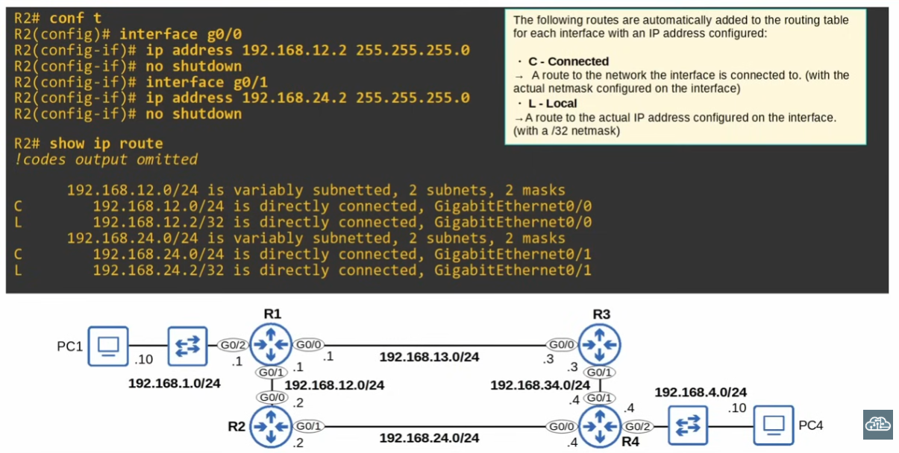
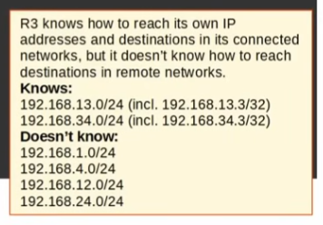
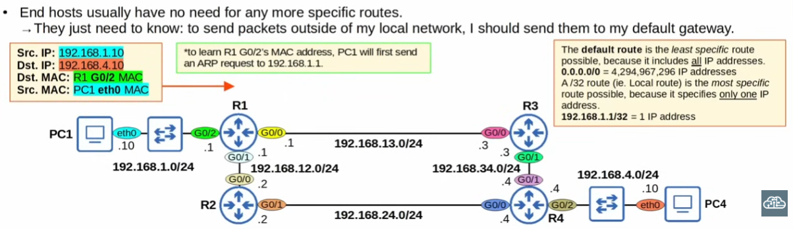
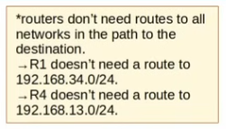
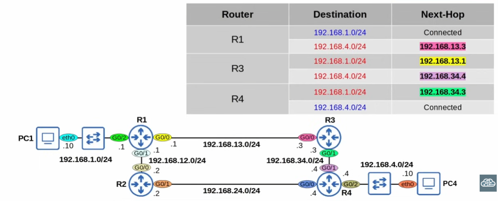
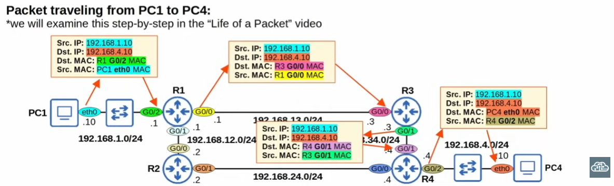
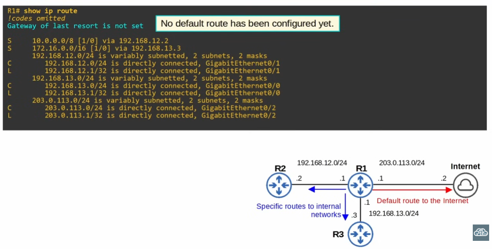

## How can we use static routes to tell routers how to forward packets? How do we configure them?

First, we must configure the local interfaces of the routers within the network. When we configure IP addresses on routers via the Cisco CLI, two addresses are automatically added to the routing table: a local address and a connected address. We must remember to execute the command "no shutdown" when we configure IP addresses



>Let's keep in mind that R2 knows how to reach it's own IP addresses and destinations in it's connected networks but it does not know how to reach destinations in remote networks. Same applies to other routers in the network, such as R3 and R4:\
\


### Routing packets: default gateway

End hosts like PC1 and PC4 can send packets directly to destinations in their connected network. 

To send packets to destinations outside of their local network, they must send their packets to a default gateway.

```
iface eth0 inet static
    address 192.168.1.10/24
    gateway 192.168.1.1
```

>In Linux, this command configures the interface eth0 with a static IP address.\
inet specifies IPv4, while inet6 specifies IPv6. It tells the system to use a fixed IP address for the interface instead of having it assigned automatically using a DHCP server (Dynamic Host Config. Protocol)

The default route is the *least specific* route possible, because it includes all IP addresses. 0.0.0.0/0 = 4,294,967,296 addresses\
The **default gateway** is a route to 0.0.0.0/0 and it is also called default route sometimes\
\
End hosts usually have no need for any more specific routes, as they only need to know that to packets outside of their local network they must send them to their default gateway

---
Example
---
Suppose we have the following packet in the network we have been examining:

```
Src. IP: 192.168.1.10
Dst. IP: 192.168.4.10
Dst. MAC: R1 G0/2
Src. MAC: PC1 eth0 MAC
```



We must remember that in order to learn the MAC address of R1's G0/2 interface, it has to send an ARP request to it's local IP address. A router has a MAC address for each interface, not just one.

>Key points:
Routers forward packets based on the most specific matching route in their routing table.
If no route matches the destination IP (including no default route), the packet is discarded.\
Routers do not guess or forward based on “closest-looking” IPs.\
Connected networks that are not a match are ignored.\
Only exception: if a default route (0.0.0.0/0) exists, the packet is sent there. 

To ensure that PC1 and PC4 can communicate, each router in the path needs **two** routes in order to ensure two-way reachability: one to 192.168.1.0/24 and one to 192.168.4.0/24



>R1 already has a connected route to 192.168.1.0/24 and R4 already has a connected route to 192.168.4.0; the other routes must be manually configured using static routes



>"S" is the code for static routes


## And then for R3 and R4

```
R3(config)# ip route 192.168.4.0 192.168.34.4
R3(config)# ip route 192.168.1.0 192.168.13.1
```

```
R4(config)# ip route 192.168.1.0 192.168.34.3
```

To test it out, we can ping PC4 from PC1. If it is successful, there is 2-way reachability!



We can also configure static routes with exit-interface, like this:\n

R2(config)# ip route 192.168.1.0 255.255.255.0

We can also specify both the exit interface and next-hop, following *this* syntax:

R2(config)# ip route 192.168.4.0 255.255.255.0 g0/1 192.168.24.*4*

>Interestingly, if we configure a path to 192.168.1.0/24 in R2 using exit-interface it'll appear when we execute the command do show ip route that that network address is "directly connected", when it's clear that it is not\
\
This happens because static routes in which only the exit interface is specified rely on a feature called proxy ARP to function (beyond the CCNA)\
It's worth clarifying that no configuration method is better than the other, which one is used depends on preference
---
## How to configure a default route on a Cisco router

***NOTE:***
Internal networks (LANs, private subnets) are used by businesses to improve speed, reliability, and security of communications between related systems.\
Static routing is often applied within or between these internal networks to explicitly define paths, reducing the need for dynamic route computation.\
The main goal is efficient and predictable routing, not just raw speed, although internal paths are typically faster than traversing external networks.



>R1(config)# ip route 0.0.0.0 0.0.0.0 203.0.113.2

Why is there an asterisk? An asterisk indicates that a route is a candidate to become a router's default route; it is possible to have multiple candidates

# Summary:

>Review: Connected & local routes\
\
Intro to static routes\
\
Static route config: ip route ip-address netmask next-hop\
ip route ip-address netmask exit-interface\
ip route ip-address netmask exit-interface next-hop\
\
Default routes
