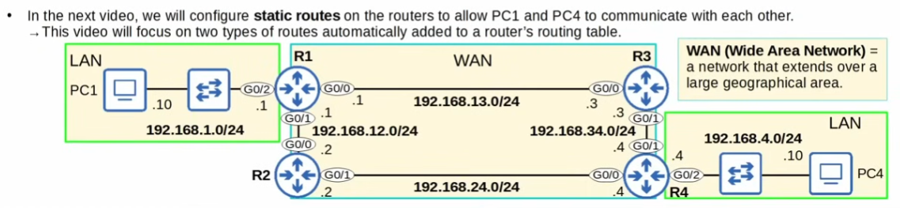
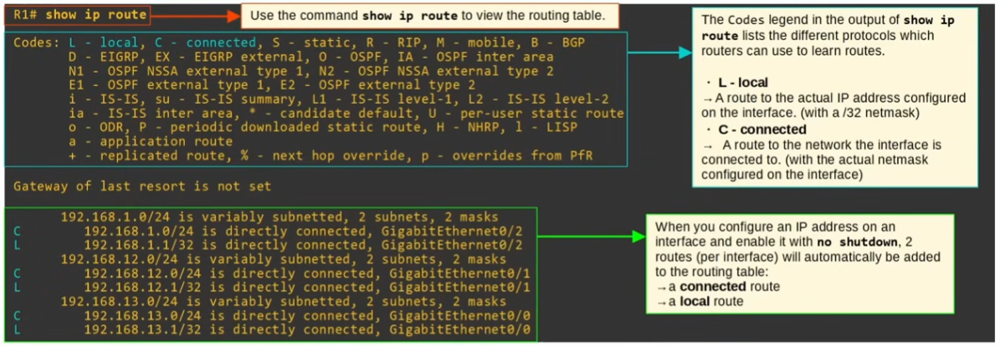
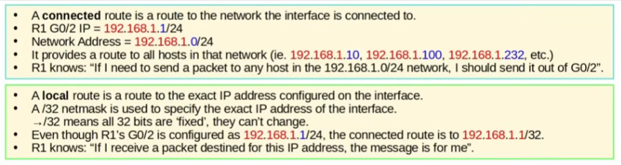
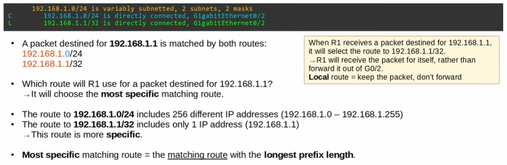
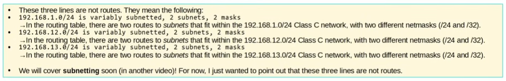
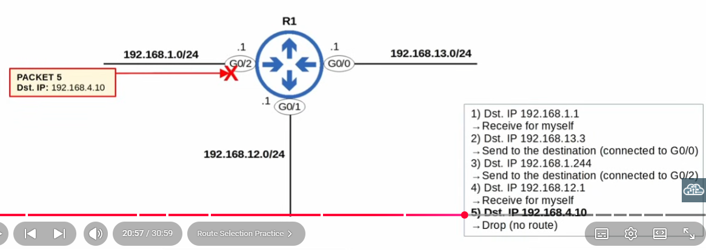
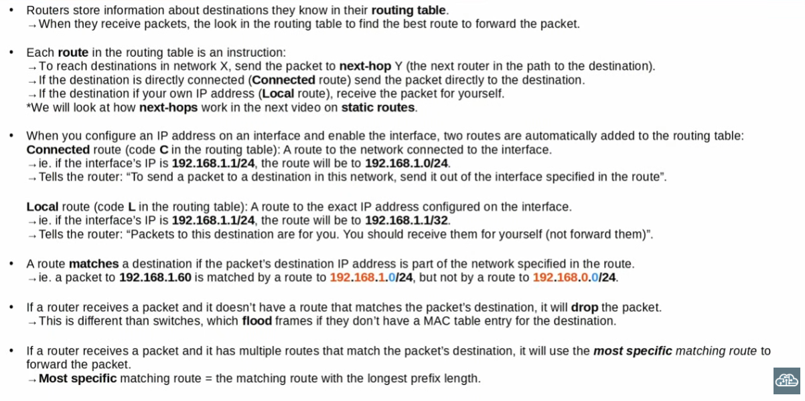

# Routing Fundamentals

What we will cover:
- What is routing?
- The routing table on a Cisco router
- Router fundamentals & route selection
---
>Routing: proceso que usan los routers para determinar el "camino" que paquetes deben tomar sobre una red para alcanzar su destino. El concepto de enrutamiento aplica tanto a WANs y LANs

|                                                                      Dynamic Routing                                                                       |                                      Static Routing                                       |
| :--------------------------------------------------------------------------------------------------------------------------------------------------------: | :---------------------------------------------------------------------------------------: |
| Los routers usan protocolos de enrutamiento dinámicos cómo OSPF para compartir información de enrutamiento entre sí y construir sus tablas de enrutamiento | En el caso de "Static Routing", un ingeniero configura manualmente las rutas en el router |
---
Una ruta le dice al router:
- "Envía un paquete al destino X"
- "Envía un packete a la dirección del próximo router en camino hacia el destino final"
- Alternativamente, si el destino está **directamente conectado al router**, "envíalo directo al destino" 
- O, si el destino es la dirección IP del router mismo, "recibilo vos mismo"

\
*Una WAN es una red que se extiende sobre un área geográfica extensa* 

>Through the router's CLI we configure the IP address of each interface (g0/0 - g0/1)- Por suerte, no hace falta ejecutar el comando "exit" para pasar de una interfaz a otra, podemos tan sólo hacerlo "de manera directa". Recordar dsp. de configurar la dirección IP de aplicar el comando "no shutdown", ya que acá se trata de un router y no de un switch

### El comando show ip route muestra la "routing table"

Al ejecutarlo, podemos ver "the codes legend", sección que ofrece un listado de los distintos protocolos que los routers pueden usar para aprenderse rutas
\
Hoy veremos L (local) y C (connected). The difference between local IP addresses and connected IP addresses matters because that distinction marks a difference in how packets are routed and sent.\
*NOTE:* Nodes generally know only their immediate neighbors (next hops) and destination prefixes, not the full topology or the other networks a neighbor is connected to.\
\
Las direcciones locales no se aprenden a través de procesos de enrutamiento, sino que las direcciones de las interfaces locales son propias del router en sí
\
\
Además del "codes legend" podemos observar la tabla de enrutamiento misma, con sus direcciones destino, "next hop", distancia administrativa (mientras menor sea, mejor) y "metric" (nro. utilizado para cada protocolo de enrutamiento para determinar la mejor ruta)

### Local
>Funciona cómo una "puerta" a una subred en específico- hace referencia a la dirección IP asignada a un router en una LAN en particular. Un "default gateway" es la dirección IP local de la interfaz del router que conecta a esa LAN a la WAN. (/32 netmask)

### Connected
>Ruta a la red a la que una determinada interfaz se conecta (la "netmask" de una dirección conectada depende de la netmask de la red local en sí)

---
Cuándo configuramos una dirección IP en una interfaz y ejecutamos el comando "no shutdown", automáticamente se agregan dos rutas a la tabla: a connected route & a local route. *Estas rutas no responden ni al enrutamiento dinámico o estático, simplemente se agregan automáticamente al configurar las interfaces*

---

---
## Example

Say R1 receives a packet from any interface with an IP address that matches 192.168.1.0/24 (any address between 192.168.1.0 - 192.168.1.255), it will know to send it out of g0/2, since that interface corresponds with the connected address automatically configured via the CLI. If it receives a packet with the IP address of 192.168. ***2*** .1 however, it'll either send the packet out of a different interface that matches the address, or drop it if no such address exists in it's routing table.

*A route matches a packet's destination if the packet's destination IP address is part of the network specified in the route*

If we're talking local routes however, they must coincide in an exact manner- 192.168.1.1/32 & 192.168.1.1/32

---
## Route selection

Most specific matching route = the *matching route* with the longest prefix length

Routers always use the longest prefix match (most specific route) in the routing table to forward a packet

### Routers NEVER flood packets the way switches do- If a router receives a packet for which it does not have a matching address in it's routing table, it will drop the packet.

 

 