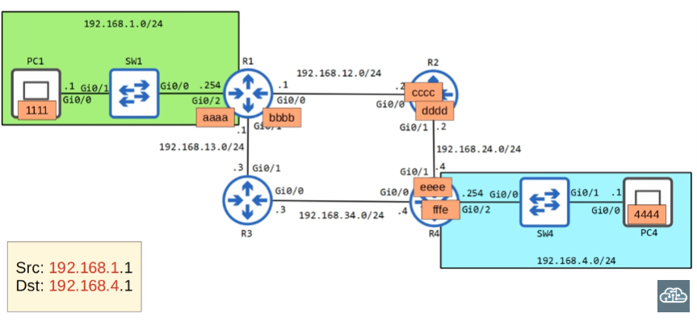

# Life of a Packet

El proceso entero de envío de un paquete a un destino remoto; ARP, encapsulación y "de-encapsulation" inclusive

Each interface in a router has it's own MAC address

>We will use the diagram used in the "static routing" video; but this time, we will also include the MAC addresses of the corresponding routers

1. PC1 must first use ARP (L2), since it has not sent any traffic yet

>ARP REQUEST\
Src IP: 192.168.1.1\
Dst IP: 192.168.1.254\
Dst MAC: FFFF.FFFF.FFFF <--- Since it does not know the address of R1\
Src MAC: 1111

PC1 is basically saying: "Hi 192.168.1.254, what is your MAC address?"

2. The switch forwards the frame out of all it's interfaces except the one it received the frame from

3. R1 sends a unicast reply (unlike PC1's broadcast request) to PC1. Let's remember that switches learn MAC addresses from the source MAC address field of a frame header

4. Now that PC1 knows the address of it's default gateway, it sends the packet to the corresponding interface so that R1 can take it from there; R1 uses an ARP request to get R2's MAC address.

5. The process continues as such: After R1 receives R2's MAC, it forwards the frame to it's interface. R2 receives it, de-encapsulates it to learn the destination IP address and forwards the frame accordingly with the help of it's routing table. This process of ARP requests and replies, de-encapsulation and routing continue until the frame reaches it's intended recepient.

---
### Clarification

Say, if after this process is completed, PC4 wants to send a frame to PC1, the routers in the path will not have to re-do the corresponding ARP requests and replies. Routers store ARP entries, learned dynamically or configured statically, that map IP addresses to MAC addresses of directly connected neighboring interfaces

Note: You can configure through a router's CLI a MAC address different to that one "burned in" by the device manufacturer