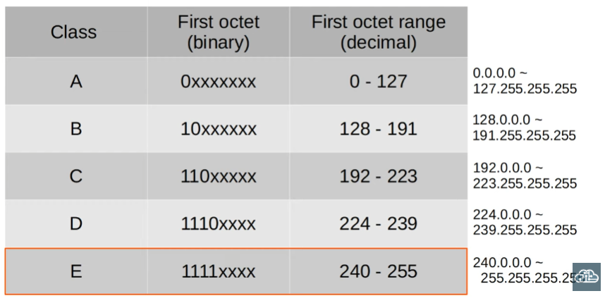
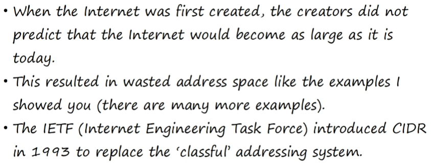

# Subnetting

What will we cover? -> CIDR (Classless Inter-Domain Routing)

Throws IPv4 classes out the window; allows for more flexibility within IPv4 networks\
Let's remember that there are 5 IPv4 classes: A, B, C, D, E. Each class' first octet has a different range

Only the classes A, B, C can be assigned to a device as an IP address

The differing prefix lengths give the classes different characteristics 

## Assignment of IP addresses

>How do companies get their own OUIs?\
Through a non-profit company called "the IANA" (or Internet assigned authority)\
This organization assigns IPv4 addresses/networks to companies based on their size. A very large company might receive a class A or class B network, while a small company might get a class C network. 

This system however might result in wasted IP addresses, so there are measures to compensate for this deficiency

---

>We take a point-to-point network as an example; one that connects networks between two different cities\
Within that network, we waste 256 - 1 (network address) - 1 (broadcast address) - 1 (R1 address) - (R2 address) = 252 addresses!

With CIDR, the requirements of A = /8, B = /16 and C = /24 were removed, allowing for larger networks to be split into smaller ones, enabling greater efficiency. These smaller networks are called *subnetworks* or *subnets*

- Instead of using a full Class C network (256 addresses) for a small subnet, you can “borrow” bits from the host portion to create smaller subnets.

- This reduces wasted IP addresses by allocating only as many addresses as needed.

### However...

>CIDR doesn’t just “take away host bits of class C networks”; it applies to any IP block.\
The focus is on flexible allocation and efficient address usage, not strictly reducing Class C host counts.
---

In point-to-point networks it is valid to have a /31 subnet mask, given that we can "break the rules" of IP address configuration and assign the only two available host addresses to the only two interfaces in the network

- Typically /32 addresses are only used when you want to configure a route to one specific host rather than a network

