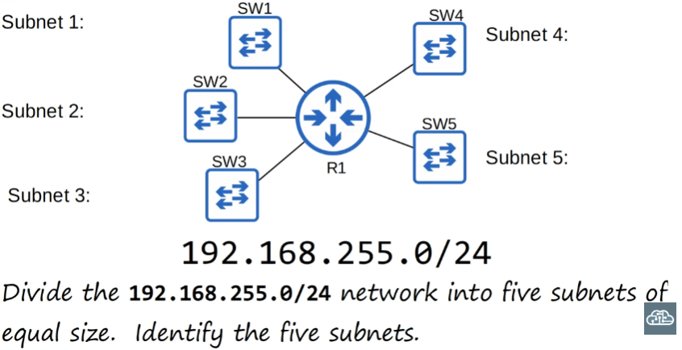
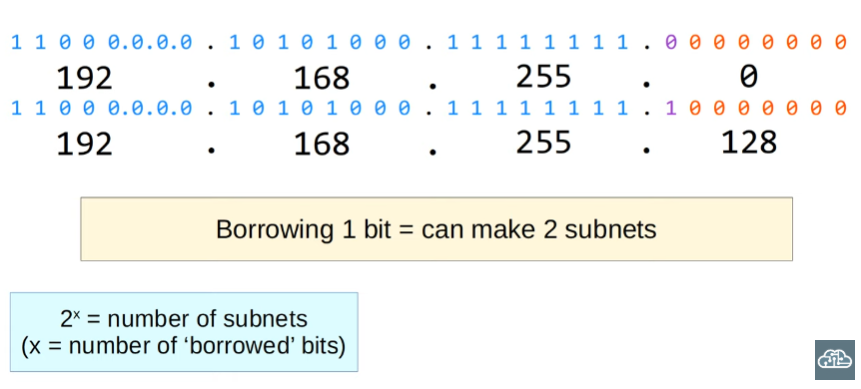
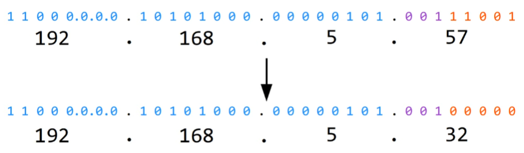
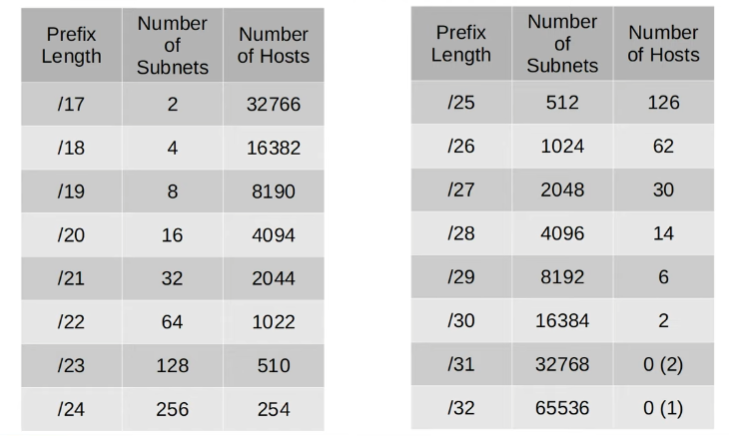

# Day 14: Pt. 2 of Subnetting :ear_of_rice:

- Subnetting practice questions
- Subnetting class B networks

---

>Successfully solved the exercise from the previous video!

## Subnetting trick :cherry_blossom:

I think it's the one I used when tackling the exercise
---

Exercise 2: 

To make 5 subnets, we will need to borrow at least 3 bits. Two is not enough because 2^(2) = 4

- Subnet 1: 192.168.255.0/27
- Subnet 2: 192.168.255.32/27
- Subnet 3: 192.168.255.64/27
- Subnet 4: 192.168.255.96/27
- Subnet 5: 192.168.255.128/27

## How to find out what subnet a host address belongs to:

# Subnetting larger networks - Class B :cherry_blossom::ear_of_rice::ear_of_rice:

>I will complete the exercises and verify in the next video!

1. /23 :white_check_mark:
2. 172.21.96.0/20 :white_check_mark:
3. 192.168.91.127/26 :white_check_mark:
4. 172.16.64.0/18 = network; 172.16.127.255/18 =  broadcast :white_check_mark:
5. 64 subnets :white_check_mark: