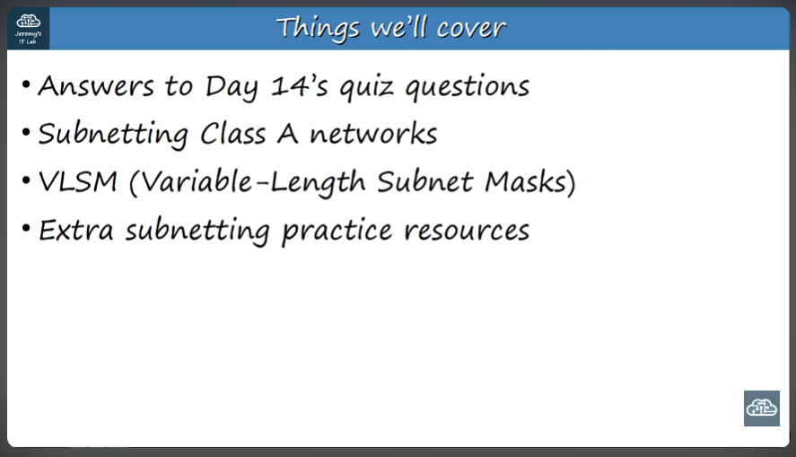
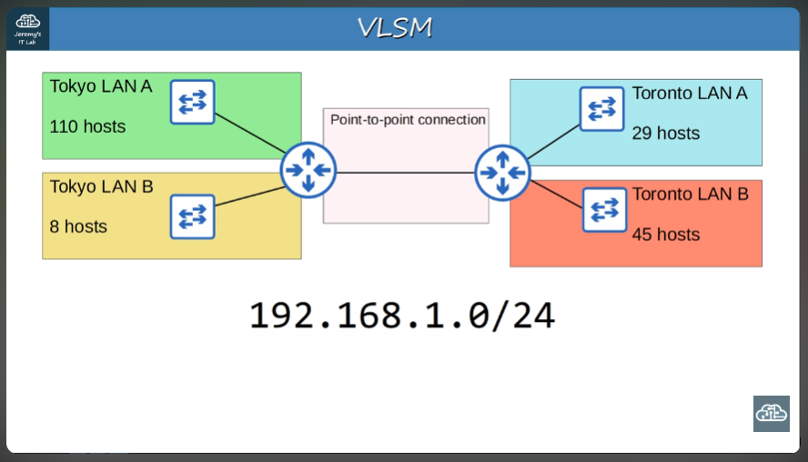
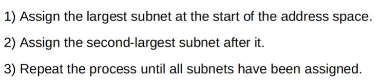
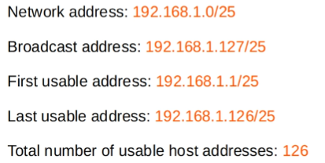

# More subnetting! 

### Subnetting Class A - Exercises

1. Prefix length: /19
2. I got them all right!

## VLSM: Variable-Length Subnet Mask

>Process of creating subnets of different sizes. It's a little harder than Fixed-Length Subnetting\
For example...

Were we to use FLSM here, we would need 5 subnets, so the subnet mask would be 24 + 3 = 27. This would not allow for sufficient host bits to support, for example, Tokyo LAN A or Toronto LAN B.

*The solution is VLSM!*

Note: For point-to-point connections, although we can *technically* use /31 prefixes, it's best to use /30 since it is supported on all devices and IOS versions

>I think this was kinda easy!

## Additional practice: 
- How many subnets and hosts per subnet can you get from the network 172.28.0.0/22?