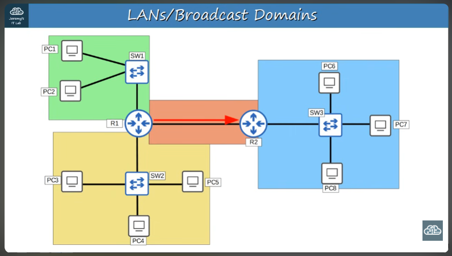
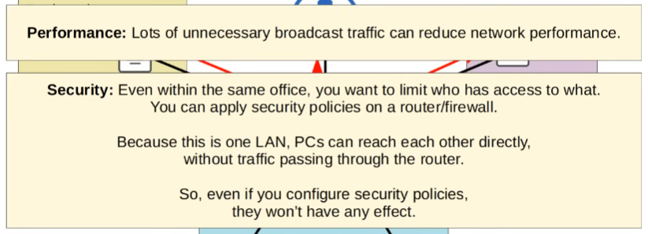
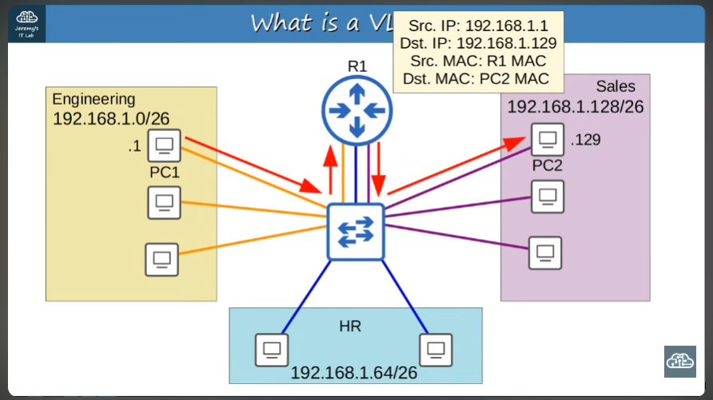

# VLANs : Virtual LAN

- What is a LAN?
- Broadcast domains
- What is a VLAN? What is it's purpose?
- How to configure VLANs on Cisco switches

>Previously it was said that a LAN is a group of devices in a single location\
More specifically however, we can say that a LAN is a single broadcast domain, including all devices in that broadcast domain

---
### Un "broadcast domain" es el grupo de dispositivos que recibirán un "broadcast frame" con dirección MAC destino FFFF.FFFF.FFFF envíado por uno de los miembros

*When a router receives a broadcast frame, IT DOES NOT FORWARD IT



>Un broadcast domain es el grupo de dispositivos que recibirán un broadcast frame (destino FFFF.FFFF.FFFF) enviado por cualquiera de los integrantes

### Qué es una VLAN? :cherry_blossom:

>Within the network of a company with different departments, it is best to divide the hosts corresponding with each department into different subnets, to prevent a situation where, for example, a PC in the engineering dept. sends out a frame intended for other machines within the engineering network to all devices within the company network, causing a potential security hazard and creating performance reduction within the network, since a lot of unnecessary broadcast traffic affects it negatively.





>A switch however, is a layer 2 device, meaning that even if we seperate the company IP network into subnets, the network will still work the same at the data link layer. Regardless of the destionation IP address, if a broadcast frame's destination MAC is all Fs, the switch will flood the frame

**VLANs are used to divide larger networks into smaller networks at the layer 2 level; we can configure them on the switch's interfaces**\
A switch will not forward traffic between VLANs and will consider each one as it's own LAN

- Vale la pena aclarar que un switch no realiza enrutamiento entre VLANs, de eso se ocupa el router
---

Entonces, las VLANs
- Son configuradas en los switches, de tal manera que cada interfaz es asignada a una VLAN que determina la red "lógica" a la que pertenece 
- Dividen una red más grande a nivel de la capa 2

### Basic VLAN config. 
- VLAN 10: G1/0 - G1/3
- VLAN 20: G2/1 - G2/2
- VLAN 30: G3/0 - G3/3

To view existing VLANs on the switch, we can go to the CLI and type the command "show vlan brief" in privileged exec mode

Even if we don't configure any VLANs, by default all interfaces belong to "VLAN 1"\
VLANs 1, 1002-1005 exist by default and *cannot* be deleted

### How do we assign VLANs to interfaces?

```
SW1(config)#interface range g1/0 - 3
SW1(config-if-range)#switchport mode access
SW1(config-if-range)#switchport access vlan 10
% Access VLAN does not exist. Creating vlan 10
```

>An access port is a switchport which belongs to a single VLAN, and usually connects to end hosts like PCs\
Trunk ports refer to switchports which carry multiple VLANs

### Name assignment to VLANs: 

```
SW1(config)#vlan 10
SW1(config-vlan)#name ENGINEERING
SW1(config-vlan)#vlan 20
SW1(config-vlan)#name HR
SW1(config-vlan)#vlan 30
SW1(config-vlan)#name SALES
```

If we execute the command ping 255.255.255.255 from a PC in VLAN10, that frame will be sent out only to devices within the same VLAN

The "why" of VLANs lies in their enforcement of security and reduction of unnecessary network traffic