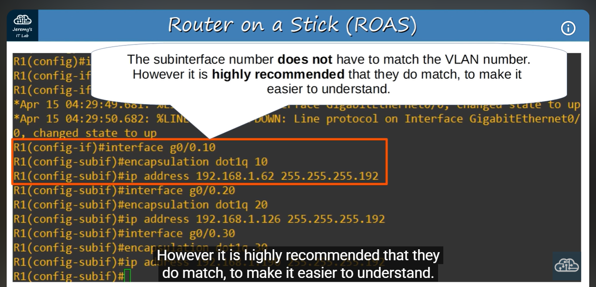
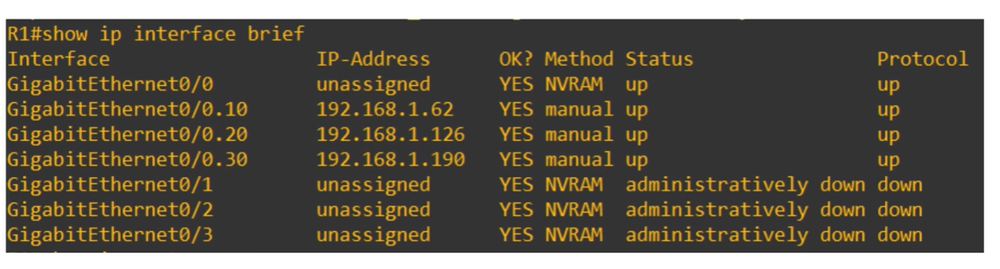
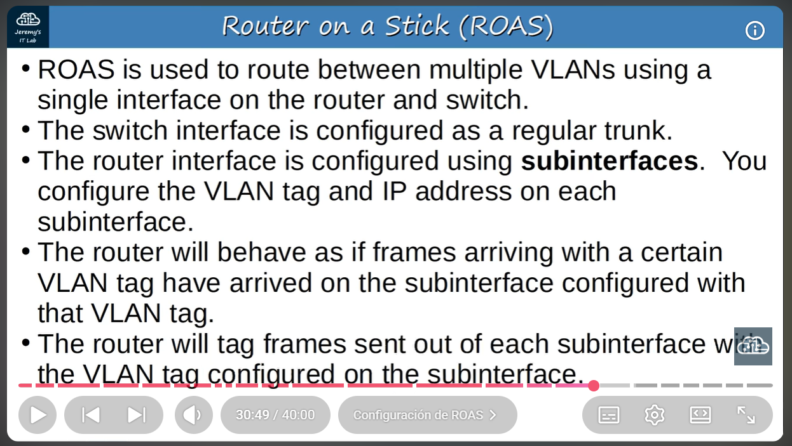

# Day 17

- What is a trunk port?
- Purpose of trunk ports 
- 802.1Q encapsulation 
- How to configure trunk ports 
- 'Router on a stick'

>Why trunk ports?  
In small networks with few VLANs the limited amount of router interfaces and switch interfaces (corresponding to VLANs) usually presents little to no issue.  
As the number of VLANs increases however, due to problems relating to preconfiguration resulting in 'wasted' switch interfaces within each VLAN (unused interfaces) and operational overhead in the case of reassignment this approach becomes less plausible

When using trunk ports, switches will tag frames to identify their belonging VLAN when forwarding frames

- Trunk ports = tagged ports
- Access ports = untagged ports

>There are mainly two protocols as it pertains to carrying the traffic of multiple VLANs over a single physical medium: ISL (Inter-Switch Linking) and IEEE 802.1Q
---

ISL is hardly ever used and largely unsupported by modern Cisco equipment.

802.1Q or 'dot1q' inserts a 4 byte field in the Ethernet header, specifically between the source and type/length fields  
The field consists of two main ones: the protocol identifier (TPID) (2 bytes in length, always set to a value of 0x8100 to indicate the protocol in use) and the tag control info. (TCI)

*The TCI itself consists of 3 fields:*
- The PCP (Priority code Point; 3 bits in length), which prioritises important traffic within congested networks
- The DEI or Drop Eligible Indicator, which merely indicates if a frame can or not be dropped if the network is congested (1 bit) and finally,
- The VID (Vlan ID), it is 12 bits in length and it identifies the VLAN the frame belongs to

---
## VLAN Ranges

***A network can sustain up to 2^(12) - 2 VLANs, ranging from 1 - 4094***

VLAN ranges include two ranges: normal VLANs (1 - 1005) and extended VLANs 1006 - 4094. Some older devices cannot use the extended VLAN range

A standard layer 2 switch only traffics frames within the same VLAN; if we want to send a frame from VLAN A to VLAN B, we will first have to pass through the router (a layer 3 device) to have it arrive at destination successfully

---
**Native VLAN: a feature found within 1dotq**

>A native VLAN is 1 by default on all trunk ports, and it describes a VLAN that does not have it's frames tagged by the switch when transmitted When a switch receives an untagged frame on a trunk port, it merely assumes the frame belongs to the native VLAN The native VLANs of neighboring trunk ports of switches must match

If there is a mismatch between two switches, the receiving switch will find a discrepancy regarding the destination MAC of the frame and the assigned native VLAN to that particular switch interface and will drop the frame

Trunk config.: 
```
SW1(config)#interface g0/0 
SW1(config-if)#switchport mode trunk
```

Switches that support both ISL and dot1q have a trunk encapsulation of 'Auto' by default (trunk encapsulation = how frames are identified on a trunk)

To manually configure the interface as a trunk port we have to set the encapsulation to dot1q or ISL

```
SW1(config-if)#switchport trunk encapsulation dot1q
SW1(config-if)#switchport mode trunk
```

We execute   
show interfaces trunk  
to confirm 

Port, Mode, Encapsulation, Status and Native vlan columns are displayed. As well as: 

- Vlans allowed on trunk
- Vlans allowed and active in management domain
- Vlans in spanning tree forwarding state and not pruned

---

>Status: trunking if the inter. is an active trunk port and successfully carrying VLANs over a single link, not-trunking if it is not operating as a trunk link

>Vlans allowed and active in management domain tells us a subset of VLANs that exist and are active on the switch

>switchport trunk allowed vlan allows us to control which VLANs can traverse a trunk port

add lets us VLANs to the list 

remove does the contrary

all means all VLANs are allowed on the trunk- this is the default state

except and none are self explanatory

---
How do you change the native VLAN? 
For security purposes it is best to change the native VLAN to an unused VLAN

COMMAND:   
```
SW1(config-if)# switchport trunk native vlan 1001
```

>The show vlan brief command shows the access ports assigned to each VLAN and NOT the trunk ports. To display the trunk ports, we must use show interfaces trunk
---

## How about R1, however? 

Previamente usamos tres interfaces distintas del router para responder a las 'default gateways' de cada VLAN. Ahora sin embargo, vamos a usar 'subinterfaces' en el router

---


Subinterfaces are assigned VLANs with the command 'encapsulation dot1q [VLAN number]' in routers so that when working with trunk ports and tagged frames, the router will route each frame accordingly corresponding to the VLAN it belongs to

>After using the encapsulation command, we assign the IP address to the subinterface like we would on any other interface

By executing the command show ip interface brief, we can see the subinterfaces





**IMPORTANT NOTE:** *Subnets provide Layer 3 separation and policy control through routing, while VLANs provide Layer 2 separation by creating separate broadcast domains on switched networks.*

---
ROAS is used to route between multiple VLANs using a SINGLE interface on a ROUTER and SWITCH

The SWITCH interface is configured as a regular TRUNK

The ROUTER interface is configured using SUB-INTERFACES. You configure the VLAN tag and IP address on EACH SUB-INTERFACE

The ROUTER will behave as if frames arriving with a certain VLAN tag have arrived on the SUB-INTERFACE configured with that VLAN tag

The ROUTER will TAG frames sent out of EACH SUB-INTERFACE with the VLAN TAG configured on the SUB-INTERFACE


