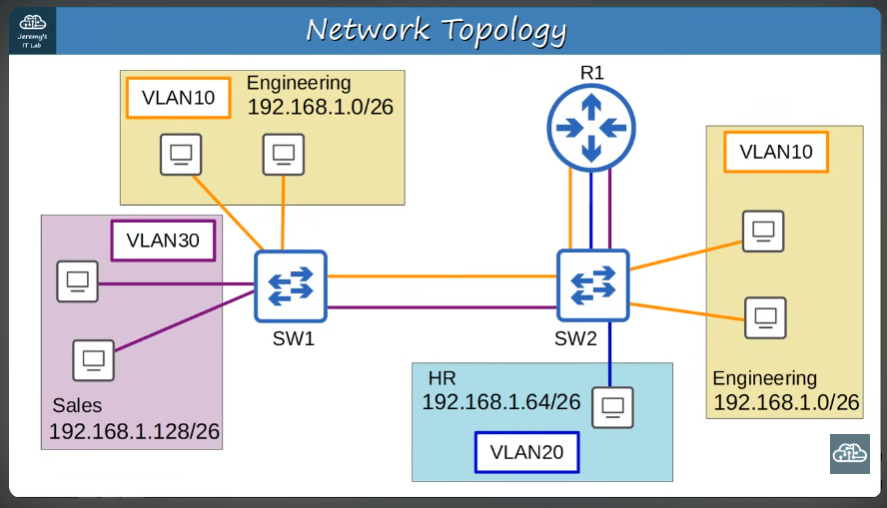

## Day 17 - VLANs pt.2

What we will cover:
- What is a trunk port?
- Purpose of trunk ports
- 802.1Q Encapsulation
  

The yellow and purple connections from SW1 and SW2 are necessary so that VLAN 30 and VLAN 10 can reach the router

>En una red pequeña con pocas VLANs, usar una interfaz en el router para cada VLAN es viable. Sin embargo, esta solución es poco escalable.\
Cada interfaz de un switch es asignada a una VLAN. La rígida y estricta asignación de interfaces a cada red virtual puede resultar en interfaces "desperdiciadas" y provoca lo que se llama "configuration overhead" al dificultar su gestión

*SOLUCIÓN:* Trunk ports. They can carry traffic from multiple VLANs on a single interface. 

How does SW1 know what VLAN a received frame corresponds to?
- The answer is tagging. Switches "tag" all frames that they send over a trunk link, to identify the VLAN that the frame belongs to 

---
- Access port = "untagged" ports
- Trunk ports = "tagged" ports
