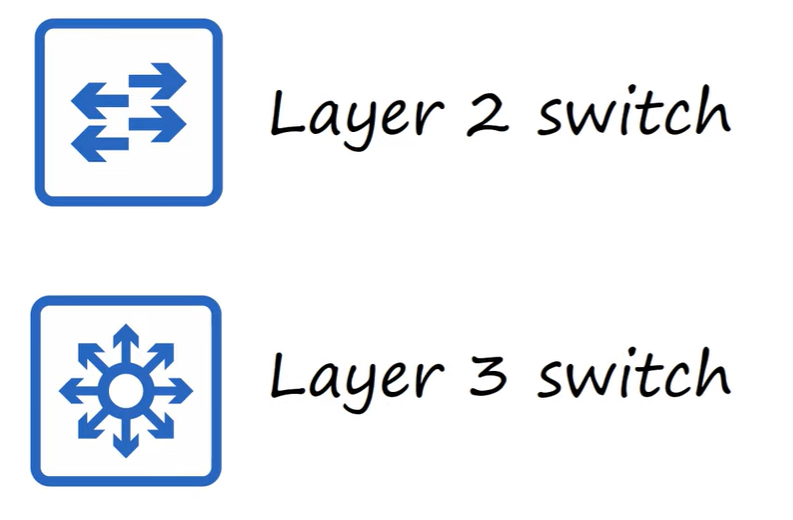
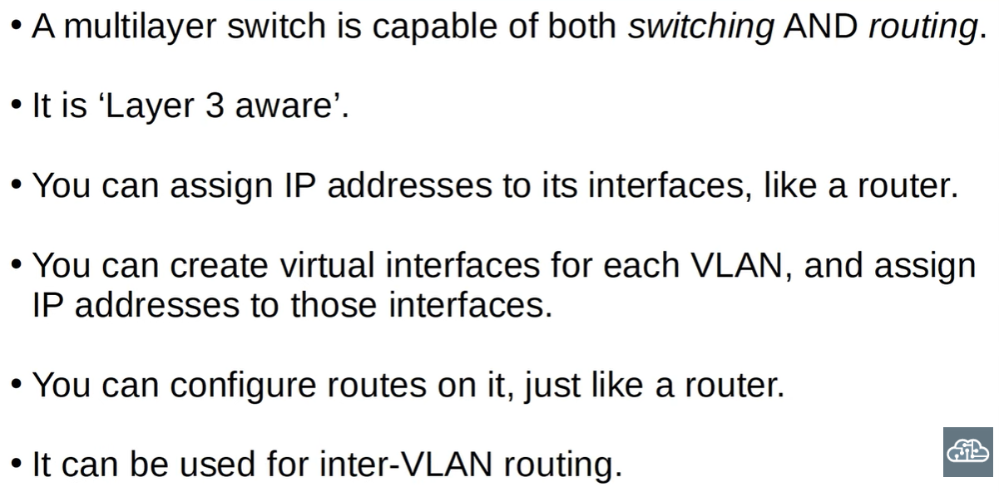
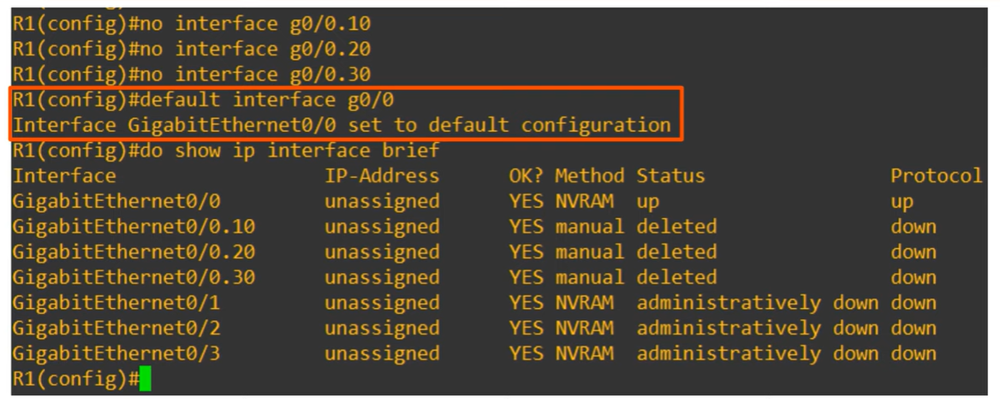
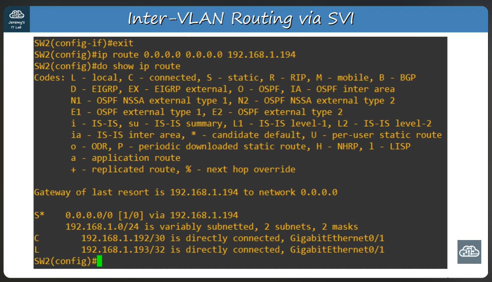
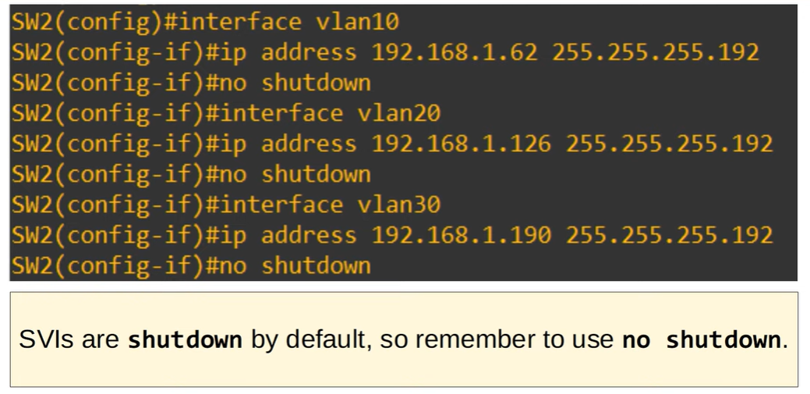

## Day 18 - VLANs Part 3

**Topics covered:**
- Native VLAN on a router
- Layer 3 switching/multilayer switching  
---

>Layer 3 switching refers to the ability of a switch with routing capabilities to forward packets between VLANs using Layer 3 (IP) information, without relying on an external router to establish inter-VLAN communication.

To configure a native VLAN on a router, we can...

- Use the command:

```
R1(config)#interface g0/0.10
R1(config-subif)#encapsulation dot1q native 10
```

Or, alternatively...
- Configure the native VLAN's IP address directly on the router's physical interface

```
R1(config)#interface g0/0
R1(config-if)#ip address 192.168.1.62 255.255.255.192
```





- The virtual interfaces on switches that represent VLANs at their third level are called SVIs, short for Switch Virtual Interfaces  
SVIs enable IP address assignment to VLANs, act as the default gateway for hosts in that VLAN and route traffic between VLANs 

### At Layer 3 (SVIs):

1. Each VLAN is mapped to one IP subnet

2. The SVI is the Layer 3 identity of that VLAN

3. The SVI provides: 
    - An IP address
    - A default gateway
    - A routing table entry

---
>IN ESSENCE: An SVI acts as the Layer 3 representation of a VLAN, which is a Layer 2 construct.

Hosts must use as their default gateway the Layer 3 device that performs routing for their VLAN; therefore, when working within a network that employs layer 3 switches we must set the default gateway to be the IP address corresponding to the appropriate SVI, not the router's default gateway
---

NOTE: *A Layer 3 switch typically has a default route pointing to the IP address of the directly connected router interface (its next-hop)*

---
## Configuring the router & switch



As for the switch...

```
SW2(config)#default interface g0/1
SW2(config)#ip routing
SW2(config)#interface g0/1
SW2(config-if)#no switchport
SW2(config-if)#ip address 192.168.1.193 255.255.255.252
```

1. Restores the G0/1 interface to factory settings
2. Enables layer 3 routing on the switch and allows it to be more than just a layer 2 device
3. Revokes VLAN membership/s, removes trunking and tagging 
4. Assigns an IP address to the interface. Point-to-point links typically have a /30 subnet



### Inter-VLAN Routing via SVI

